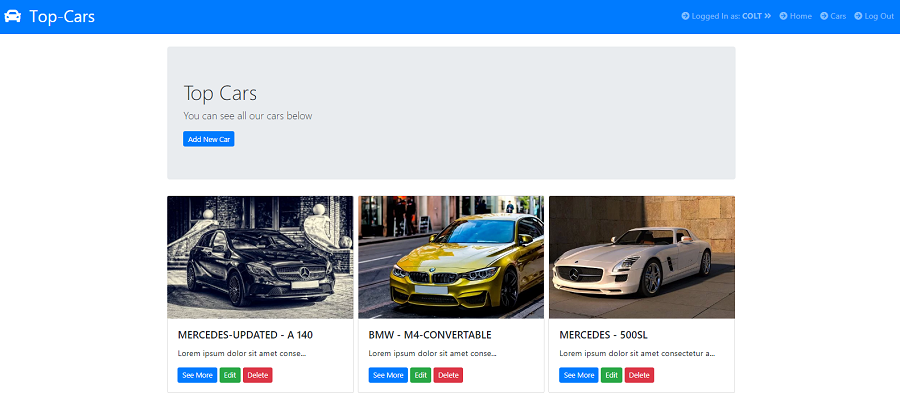

# Top-Cars in Node.js

Top-Cars is a simple CRUD app. It was created for mobile and desktop views. One can add, remove, edit, or show
specific car. One can also add comment to a specific car. There is also authentication logic added to an app. 

## Tools & Technology used

- Visual Studio Code
- Node.js
- Express
- MongoDB
- JavaScript
- Mongoose
- .ejs
- SASS
- body-parser
